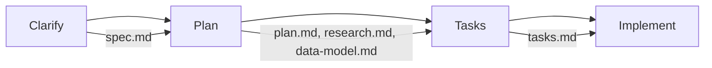

# Spec Kit Commands Short Reference

**Version**: 1.0  
**Created**: 2025-11-01  
**Purpose**: Quick reference guide for Spec Kit methodology and commands

## Overview

Spec Kit is a systematic approach to feature development that follows a structured workflow: **Clarify → Plan → Tasks → Implement**. Each phase has specific commands and outputs that guide the development process.

## Workflow Phases



---

## Phase 1: Clarification (`speckit.clarify`)

### Purpose
Refine user requirements into detailed specifications with clarifications and user stories.

### Commands

#### Basic Clarification
```bash
# Follow clarification workflow
"Follow instructions in [speckit.clarify.prompt.md]"
```

#### With Specific Requirements
```bash
# Add specific technical requirements during clarification
"Follow instructions in [speckit.clarify.prompt.md] with requirement: smart pointer usage mandatory"
```

### Inputs
- User description or feature request
- Additional requirements or constraints

### Outputs
- `specs/{feature-id}/spec.md` - Enhanced specification with clarifications
- Updated user stories with priorities
- Functional requirements (FR-001, FR-002, etc.)
- Acceptance scenarios and edge cases

### Example Usage
```bash
# Initial user request:
"The Isched universal application server backend should simplify web application development"

# Clarification command:
"Follow instructions in [speckit.clarify.prompt.md]"

# Result: Enhanced spec with 22 functional requirements and 3 prioritized user stories
```

---

## Phase 2: Planning (`speckit.plan`)

### Purpose
Create comprehensive implementation plan with technical decisions and project structure.

### Commands

#### Basic Planning
```bash
# Follow planning workflow
"Follow instructions in [speckit.plan.prompt.md]"
```

#### Enhanced Planning with Documentation
```bash
# Add documentation generation requirement
"Follow instructions in [speckit.plan.prompt.md] with documentation generation requirement"
```

### Inputs
- `spec.md` from clarification phase
- Existing project structure and constitution
- Technical constraints

### Outputs
- `specs/{feature-id}/plan.md` - Implementation plan with architecture
- `specs/{feature-id}/research.md` - Technical decisions and alternatives
- `specs/{feature-id}/data-model.md` - Entity definitions and C++ classes
- `specs/{feature-id}/contracts/` - API contracts and schemas
- `specs/{feature-id}/quickstart.md` - Developer getting started guide

### Example Usage
```bash
# After spec.md is complete:
"Follow instructions in [speckit.plan.prompt.md]"

# Result: Complete technical plan with C++23, multi-process architecture, 
# smart pointer usage, and Doxygen documentation generation
```

---

## Phase 3: Task Generation (`speckit.tasks`)

### Purpose
Break down implementation plan into actionable development tasks organized by phases.

### Commands

#### Task Breakdown
```bash
# Follow task generation workflow
"Follow instructions in [speckit.tasks.prompt.md]"
```

### Inputs
- `spec.md` - User stories and requirements
- `plan.md` - Technical architecture and structure
- `data-model.md` - Implementation classes
- `contracts/` - API specifications

### Outputs
- `specs/{feature-id}/tasks.md` - Comprehensive task breakdown with:
  - User story mapping
  - Phase-based organization
  - Task dependencies
  - Effort estimation
  - Parallel execution opportunities

### Example Usage
```bash
# After planning phase is complete:
"Follow instructions in [speckit.tasks.prompt.md]"

# Result: 32 implementation tasks across 4 phases (232 hours estimated)
# with dependency graph and parallel execution tracks
```

---

## Phase 4: Implementation

### Purpose
Execute the implementation tasks in the planned order.

### Approach
- Follow tasks.md phase by phase
- Use task dependency graph for parallel development
- Validate acceptance criteria for each task
- Update agent context as technologies are added

---

## File Structure

### Generated Files
```text
specs/{feature-id}/
├── spec.md              # Phase 1: Enhanced specification
├── plan.md              # Phase 2: Implementation plan  
├── research.md          # Phase 2: Technical decisions
├── data-model.md        # Phase 2: Entity definitions
├── quickstart.md        # Phase 2: Getting started guide
├── contracts/           # Phase 2: API contracts
│   ├── graphql-schema.md
│   └── http-api.md
└── tasks.md             # Phase 3: Implementation tasks
```

### Supporting Scripts
```text
.specify/scripts/bash/
├── check-prerequisites.sh    # Validate workflow prerequisites
├── update-agent-context.sh   # Update AI assistant context
└── validate-constitution.sh  # Check constitutional compliance
```

---

## Common Examples

### Example 1: New Backend Feature
```bash
# 1. Clarify requirements
"Follow instructions in [speckit.clarify.prompt.md]"

# 2. Create implementation plan
"Follow instructions in [speckit.plan.prompt.md]"

# 3. Generate task breakdown
"Follow instructions in [speckit.tasks.prompt.md]"

# 4. Update agent context
".specify/scripts/bash/update-agent-context.sh"
```

### Example 2: Adding Documentation Requirement
```bash
# During planning phase, add requirement:
"Follow instructions in [speckit.plan.prompt.md] with documentation generation requirement"

# Result: Doxygen integration added to build process and task breakdown
```

### Example 3: Memory Safety Requirement
```bash
# During clarification, add C++ Core Guidelines compliance:
"Follow instructions in [speckit.clarify.prompt.md] with requirement: smart pointer usage mandatory"

# Result: FR-021 added requiring std::unique_ptr/std::shared_ptr usage
```

---

## Best Practices

### Workflow Execution
1. **Sequential Phases**: Complete each phase before moving to the next
2. **Iterative Refinement**: Re-run phases when requirements change
3. **Context Updates**: Run `update-agent-context.sh` after each phase
4. **Constitution Compliance**: Validate against project constitution

### Requirement Specification
- Use specific technical requirements (e.g., "smart pointer usage mandatory")
- Include performance targets (e.g., "20ms response times")
- Specify compliance standards (e.g., "GraphQL specification compliance")

### Task Organization
- Group tasks by user story priority (P1, P2, P3)
- Identify parallel execution opportunities
- Include clear acceptance criteria with checkboxes
- Estimate effort for project planning

### Documentation Integration
- Add documentation generation requirements during planning
- Include code examples in specifications
- Generate comprehensive API references
- Create developer quickstart guides

---

## Quick Command Reference

| Phase | Command | Primary Output |
|-------|---------|----------------|
| Clarify | `"Follow instructions in [speckit.clarify.prompt.md]"` | `spec.md` |
| Plan | `"Follow instructions in [speckit.plan.prompt.md]"` | `plan.md`, `research.md`, `data-model.md` |
| Tasks | `"Follow instructions in [speckit.tasks.prompt.md]"` | `tasks.md` |
| Context | `".specify/scripts/bash/update-agent-context.sh"` | Updated AI context |

### Command Modifiers
- Add requirements: `"... with requirement: [specific requirement]"`
- Add features: `"... with [feature] generation requirement"`
- Target specific output: `"... focusing on [aspect]"`

---

## Troubleshooting

### Common Issues

**Missing Prerequisites**
```bash
# Check workflow prerequisites
".specify/scripts/bash/check-prerequisites.sh --json"
```

**Constitution Violations**
```bash
# Validate constitutional compliance
".specify/scripts/bash/validate-constitution.sh"
```

**Context Sync Issues**
```bash
# Manually update agent context
".specify/scripts/bash/update-agent-context.sh"
```

### Error Resolution
- **Missing spec.md**: Re-run clarification phase
- **Incomplete planning**: Add missing requirements and re-run planning
- **Task dependencies**: Check plan.md for architectural requirements
- **Build failures**: Verify constitution compliance and technical decisions

---

## Integration with Development Tools

### AI Assistant Integration
- Agent context automatically updated with technologies and frameworks
- Constitutional principles enforced throughout workflow
- Technical decisions preserved across sessions

### Build System Integration
- CMake configuration updated based on technical decisions
- Dependency management through Conan
- Documentation generation integrated into build process

### Version Control Integration
- Feature branch creation: `git checkout -b {feature-id}`
- Commit workflow outputs: `git add specs/{feature-id}/ && git commit -m "Add {feature-id} specification"`
- Track implementation progress through task completion

---

*This reference guide provides a complete overview of Spec Kit methodology for systematic feature development in the isched project.*