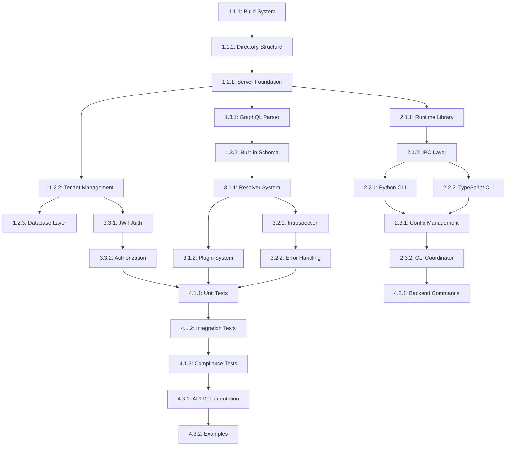

# Tasks: Universal Application Server Backend

**Input**: Design documents from `/specs/001-universal-backend/`
**Prerequisites**: plan.md (required), spec.md (required for user stories), research.md, data-model.md, contracts/

**Tests**: Test tasks included based on constitutional TDD requirements.

**Organization**: Tasks are grouped by user story to enable independent implementation and testing of each story.

## Format: `[ID] [P?] [Story] Description`

- **[P]**: Can run in parallel (different files, no dependencies)
- **[Story]**: Which user story this task belongs to (e.g., US1, US2, US3)
- Include exact file paths in descriptions

## Path Conventions

- **Isched C++ Backend**: `src/main/cpp/` for implementation, `src/test/cpp/` for tests
- **Headers**: `src/main/cpp/isched/` for main headers
- **Dependencies**: Managed via `conanfile.txt` and CMake
- **Build**: CMake with Conan integration, use `cmake-build-debug/` for builds
- Paths shown below follow Isched project structure

## Constitutional Compliance Checklist

Each task implementation MUST verify:

- ✅ **Performance**: Multi-tenant performance maintained, cloud-to-embedded compatibility
- ✅ **GraphQL Spec**: Compliance with [GraphQL specification](https://spec.graphql.org/)
- ✅ **Security**: Industry-standard auth protocols, secure-by-default configuration  
- ✅ **Testing**: TDD approach, integration tests for GraphQL endpoints, performance tests
- ✅ **Portability**: Linux/Conan build compatibility, cross-platform documentation
- ✅ **C++ Core Guidelines**: Adherence to [ISO C++ Core Guidelines](https://isocpp.github.io/CppCoreGuidelines/CppCoreGuidelines), justified deviations documented

---

## Phase 1: Setup (Shared Infrastructure)

**Purpose**: Project initialization and C++23 structure with Conan dependencies

- [ ] T001 Create C++23 project structure per implementation plan in src/main/cpp/isched/
- [ ] T002 [P] Configure CMakeLists.txt with C++23 standard and Conan integration
- [ ] T003 [P] Setup conanfile.txt with required dependencies (pegtl, restbed, sqlite3, nlohmann_json, spdlog, jwt-cpp, catch2)
- [ ] T004 [P] Configure clang-tidy with C++ Core Guidelines compliance rules
- [ ] T005 [P] Setup automated documentation generation with Doxygen integration in CMakeLists.txt

---

## Phase 2: Foundational (Blocking Prerequisites)

**Purpose**: Core infrastructure that MUST be complete before ANY user story can be implemented

**⚠️ CRITICAL**: No user story work can begin until this phase is complete

- [ ] T006 Implement base Server class in src/main/cpp/isched/isched_server.hpp/cpp with lifecycle management
- [ ] T007 [P] Implement TenantManager class in src/main/cpp/isched/isched_tenant_manager.hpp/cpp for multi-process isolation
- [ ] T008 [P] Implement DatabaseManager class in src/main/cpp/isched/isched_database.hpp/cpp with SQLite integration
- [ ] T009 [P] Implement ConnectionPool class in src/main/cpp/isched/isched_database.hpp for per-tenant database pooling
- [ ] T010 [P] Implement basic GraphQLExecutor class in src/main/cpp/isched/isched_graphql_executor.hpp/cpp with PEGTL parser
- [ ] T011 [P] Implement AuthenticationMiddleware class in src/main/cpp/isched/isched_auth.hpp/cpp with JWT support
- [ ] T012 [P] Implement shared memory IPC framework in src/main/cpp/isched/shared/ipc/
- [ ] T013 [P] Setup Restbed HTTP service integration in src/main/cpp/isched/isched_server.cpp
- [ ] T014 [P] Implement configuration management in src/main/cpp/isched/shared/config/
- [ ] T015 [P] Setup Catch2 test framework integration in src/test/cpp/

**Checkpoint**: Foundation ready - user story implementation can now begin in parallel

---

## Phase 3: User Story 1 - Frontend Developer Setup (Priority: P1) 🎯 MVP

**Goal**: Frontend developers can configure and run a complete backend server using only Isched and a simple configuration script

**Independent Test**: A frontend developer can create a basic configuration script and successfully run a GraphQL endpoint with health monitoring

### Tests for User Story 1

> **NOTE: Write these tests FIRST, ensure they FAIL before implementation**

- [ ] T016 [P] [US1] Integration test for basic server startup in src/test/cpp/integration/test_server_startup.cpp
- [ ] T017 [P] [US1] Integration test for built-in GraphQL schema in src/test/cpp/integration/test_builtin_schema.cpp
- [ ] T018 [P] [US1] Integration test for health monitoring endpoints in src/test/cpp/integration/test_health_monitoring.cpp

### Implementation for User Story 1

- [ ] T019 [P] [US1] Implement BuiltInSchema class in src/main/cpp/isched/isched_builtin_schema.hpp/cpp with health queries
- [ ] T020 [P] [US1] Create default GraphQL resolvers for hello, version, clientCount, uptime in src/main/cpp/isched/isched_builtin_schema.cpp
- [ ] T021 [US1] Integrate BuiltInSchema with GraphQLExecutor for immediate GraphQL endpoint availability
- [ ] T022 [US1] Implement basic server lifecycle (start/stop/health) in src/main/cpp/isched/isched_server.cpp
- [ ] T023 [US1] Add automatic GraphQL playground endpoint setup in src/main/cpp/isched/isched_server.cpp
- [ ] T024 [US1] Implement GraphQL specification compliance validation in src/main/cpp/isched/isched_graphql_executor.cpp
- [ ] T025 [US1] Add enhanced error response format with Isched extensions in src/main/cpp/isched/isched_graphql_executor.cpp

**Checkpoint**: At this point, User Story 1 should be fully functional and testable independently

---

## Phase 4: User Story 2 - Procedural Configuration (Priority: P2)

**Goal**: Frontend developers can define their backend behavior through procedural scripts (Python or TypeScript)

**Independent Test**: Writing different configuration scripts modifies server behavior and changes take effect without manual server configuration

### Tests for User Story 2

- [ ] T026 [P] [US2] Integration test for Python CLI executable in src/test/cpp/integration/test_python_cli.cpp
- [ ] T027 [P] [US2] Integration test for TypeScript CLI executable in src/test/cpp/integration/test_typescript_cli.cpp
- [ ] T028 [P] [US2] Integration test for configuration script execution in src/test/cpp/integration/test_config_execution.cpp

### Implementation for User Story 2

- [ ] T029 [P] [US2] Implement CLI process framework in src/main/cpp/isched/cli/python/main.cpp for isched-cli-python
- [ ] T030 [P] [US2] Implement CLI process framework in src/main/cpp/isched/cli/typescript/main.cpp for isched-cli-typescript
- [ ] T031 [P] [US2] Create PythonExecutor class in src/main/cpp/isched/cli/python/python_executor.hpp/cpp
- [ ] T032 [P] [US2] Create TypeScriptExecutor class in src/main/cpp/isched/cli/typescript/typescript_executor.hpp/cpp
- [ ] T033 [P] [US2] Implement IPC client communication in src/main/cpp/isched/cli/python/ipc_client.hpp/cpp
- [ ] T034 [P] [US2] Implement IPC client communication in src/main/cpp/isched/cli/typescript/ipc_client.hpp/cpp
- [ ] T035 [US2] Integrate CLI process spawning with main server in src/main/cpp/isched/isched_server.cpp
- [ ] T036 [US2] Implement configuration script parsing and validation in src/main/cpp/isched/shared/config/config_parser.hpp/cpp
- [ ] T037 [US2] Add atomic configuration deployment with rollback in src/main/cpp/isched/shared/config/config_manager.hpp/cpp

**Checkpoint**: At this point, User Stories 1 AND 2 should both work independently

---

## Phase 5: User Story 3 - GraphQL Specification Compliance (Priority: P3)

**Goal**: All GraphQL interactions follow the official GraphQL specification exactly

**Independent Test**: Standard GraphQL introspection queries validate responses against the official GraphQL specification test suite

### Tests for User Story 3

- [ ] T038 [P] [US3] GraphQL specification compliance test suite in src/test/cpp/integration/test_graphql_compliance.cpp
- [ ] T039 [P] [US3] GraphQL introspection test in src/test/cpp/integration/test_graphql_introspection.cpp
- [ ] T040 [P] [US3] GraphQL client library compatibility test in src/test/cpp/integration/test_client_compatibility.cpp

### Implementation for User Story 3

- [ ] T041 [P] [US3] Implement complete GraphQL introspection support in src/main/cpp/isched/isched_graphql_executor.cpp
- [ ] T042 [P] [US3] Add GraphQL query complexity analysis in src/main/cpp/isched/isched_graphql_executor.cpp
- [ ] T043 [P] [US3] Implement GraphQL subscription support in src/main/cpp/isched/isched_graphql_executor.cpp
- [ ] T044 [US3] Add GraphQL specification test validation framework in src/main/cpp/isched/isched_graphql_executor.cpp
- [ ] T045 [US3] Implement standard GraphQL error formatting in src/main/cpp/isched/isched_graphql_executor.cpp
- [ ] T046 [US3] Add GraphQL schema validation against specification in src/main/cpp/isched/isched_graphql_executor.cpp

**Checkpoint**: All user stories should now be independently functional

---

## Phase 6: Advanced Features - Data Model and Plugin System

**Purpose**: Core data modeling and extensibility features

- [ ] T047 [P] Implement SchemaMigrator class in src/main/cpp/isched/isched_database.cpp for automatic migrations
- [ ] T048 [P] Implement ResolverRegistry class in src/main/cpp/isched/isched_plugin.hpp/cpp for plugin system
- [ ] T049 [P] Create binary plugin loading framework in src/main/cpp/isched/isched_plugin.cpp
- [ ] T050 [US2] Integrate data model generation from configuration scripts in src/main/cpp/isched/shared/config/model_generator.hpp/cpp
- [ ] T051 [US2] Add automatic GraphQL schema generation from data models in src/main/cpp/isched/isched_graphql_executor.cpp
- [ ] T052 [US1] [US2] Implement tenant process pool management in src/main/cpp/isched/isched_tenant_manager.cpp

---

## Phase 7: Performance and Authentication

**Purpose**: Performance optimization and authentication features

- [ ] T053 [P] Implement adaptive thread pool sizing in src/main/cpp/isched/isched_tenant_manager.cpp
- [ ] T054 [P] Add performance monitoring and metrics in src/main/cpp/isched/isched_server.cpp
- [ ] T055 [P] Implement per-tenant session management in src/main/cpp/isched/isched_auth.cpp
- [ ] T056 [P] Add OAuth2 provider integration in src/main/cpp/isched/isched_auth.cpp
- [ ] T057 [P] Implement JWT token validation and refresh in src/main/cpp/isched/isched_auth.cpp
- [ ] T058 [US1] [US2] Add 20ms response time optimization in src/main/cpp/isched/isched_server.cpp

---

## Phase 8: Polish & Cross-Cutting Concerns

**Purpose**: Improvements that affect multiple user stories

- [ ] T059 [P] Performance benchmark suite in src/test/cpp/performance/benchmark_suite.cpp
- [ ] T060 [P] Memory usage optimization for multi-tenant operations in src/main/cpp/isched/
- [ ] T061 [P] Documentation generation automation in CMakeLists.txt
- [ ] T062 [P] Production deployment configuration in docker/ and scripts/
- [ ] T063 [P] Security hardening and vulnerability scanning integration
---

## Dependencies & Execution Order

### Phase Dependencies

- **Setup (Phase 1)**: No dependencies - can start immediately
- **Foundational (Phase 2)**: Depends on Setup completion - BLOCKS all user stories
- **User Stories (Phase 3-5)**: All depend on Foundational phase completion
  - User stories can then proceed in parallel (if staffed)
  - Or sequentially in priority order (P1 → P2 → P3)
- **Advanced Features (Phase 6)**: Depends on User Stories 1-2 completion
- **Performance/Auth (Phase 7)**: Depends on User Stories 1-2 completion
- **Polish (Phase 8)**: Depends on all desired user stories being complete

### User Story Dependencies

- **User Story 1 (P1)**: Can start after Foundational (Phase 2) - No dependencies on other stories
- **User Story 2 (P2)**: Can start after Foundational (Phase 2) - May integrate with US1 but should be independently testable
- **User Story 3 (P3)**: Can start after Foundational (Phase 2) - May integrate with US1/US2 but should be independently testable

### Within Each User Story

- Tests MUST be written and FAIL before implementation
- Core classes before integration
- Individual components marked [P] can run in parallel
- Story complete before moving to next priority

### Parallel Opportunities

- All Setup tasks marked [P] can run in parallel
- All Foundational tasks marked [P] can run in parallel (within Phase 2)
- Once Foundational phase completes, all user stories can start in parallel (if team capacity allows)
- All tests for a user story marked [P] can run in parallel
- Implementation tasks within a story marked [P] can run in parallel
- Different user stories can be worked on in parallel by different team members

---

## Parallel Example: User Story 1

```bash
# Launch all tests for User Story 1 together:
Task: "Integration test for basic server startup in src/test/cpp/integration/test_server_startup.cpp"
Task: "Integration test for built-in GraphQL schema in src/test/cpp/integration/test_builtin_schema.cpp"
Task: "Integration test for health monitoring endpoints in src/test/cpp/integration/test_health_monitoring.cpp"

# Launch all parallel implementation tasks for User Story 1:
Task: "Implement BuiltInSchema class in src/main/cpp/isched/isched_builtin_schema.hpp/cpp"
Task: "Create default GraphQL resolvers for hello, version, clientCount, uptime"
```

---

## Implementation Strategy

### MVP First (User Story 1 Only)

1. Complete Phase 1: Setup
2. Complete Phase 2: Foundational (CRITICAL - blocks all stories)
3. Complete Phase 3: User Story 1
4. **STOP and VALIDATE**: Test User Story 1 independently
5. Deploy/demo if ready

### Incremental Delivery

1. Complete Setup + Foundational → Foundation ready
2. Add User Story 1 → Test independently → Deploy/Demo (MVP!)
3. Add User Story 2 → Test independently → Deploy/Demo
4. Add User Story 3 → Test independently → Deploy/Demo
5. Each story adds value without breaking previous stories

### Parallel Team Strategy

With multiple developers:

1. Team completes Setup + Foundational together
2. Once Foundational is done:
   - Developer A: User Story 1
   - Developer B: User Story 2
   - Developer C: User Story 3
3. Stories complete and integrate independently

---

## Summary

- **Total Tasks**: 64 tasks across 8 phases
- **User Story 1 (MVP)**: 10 tasks (T016-T025)
- **User Story 2**: 12 tasks (T026-T037)
- **User Story 3**: 9 tasks (T038-T046)
- **Parallel Opportunities**: 42 tasks marked [P] can run in parallel within their phases
- **Constitutional Compliance**: All tasks include mandatory verification against 6 constitutional principles
- **Suggested MVP Scope**: Complete Phases 1-3 (User Story 1) for immediate frontend developer value

**Format Validation**: ✅ All tasks follow required checklist format with [ID], [P] markers, [Story] labels, and exact file paths
  - [ ] Smart pointer usage for CLI command objects
- **Files to Create/Modify**:
  - `src/main/cpp/isched/cli/isched_backend_commands.hpp` (create)
  - `src/main/cpp/isched/cli/isched_backend_commands.cpp` (create)
- **Dependencies**: Task 2.3.2
- **Estimated Effort**: 6 hours

### Epic 4.3: Documentation & Examples

#### Task 4.3.1: Generate Comprehensive API Documentation
- **Description**: Create complete API documentation with Doxygen integration
- **Acceptance Criteria**:
  - [ ] Automated Doxygen documentation generation
  - [ ] API reference documentation with code examples
  - [ ] Inline source code snippets in documentation
  - [ ] Developer guides and tutorials
  - [ ] Complete working examples
- **Files to Create/Modify**:
  - `docs/api/` (generated API documentation)
  - `docs/source/` (source code with examples)
  - `docs/guides/` (developer guides)
  - `docs/examples/` (working examples)
- **Dependencies**: All implementation tasks
- **Estimated Effort**: 10 hours

#### Task 4.3.2: Create Developer Quickstart Examples
- **Description**: Create complete working examples for developers
- **Acceptance Criteria**:
  - [ ] Python configuration script examples
  - [ ] TypeScript configuration script examples
  - [ ] Complete "Hello World" backend setup
  - [ ] Authentication and authorization examples
  - [ ] Plugin development examples
- **Files to Create/Modify**:
  - `examples/` (working example projects)
  - `examples/python/` (Python configuration examples)
  - `examples/typescript/` (TypeScript configuration examples)
- **Dependencies**: Task 4.3.1
- **Estimated Effort**: 8 hours

---

## Task Dependency Graph



## Parallel Execution Opportunities

**Phase 1 Parallel Tracks**:
- Track A: Epic 1.2 (Server Infrastructure) 
- Track B: Epic 1.3 (GraphQL Infrastructure)

**Phase 2 Parallel Tracks**:
- Track A: Epic 2.1 (Dynamic Library)
- Track B: Epic 2.2 (CLI Executables) [after 2.1.2]
- Track C: Epic 2.3 (Configuration Management) [after 2.2.x]

**Phase 3 Parallel Tracks**:
- Track A: Epic 3.1 (GraphQL Features)
- Track B: Epic 3.2 (Specification Compliance) [after 3.1.1]
- Track C: Epic 3.3 (Authentication) [independent]

**Phase 4 Parallel Tracks**:
- Track A: Epic 4.1 (Testing)
- Track B: Epic 4.2 (CLI Integration)
- Track C: Epic 4.3 (Documentation) [after most implementation]

## Success Criteria Validation

**Measurable Outcomes Mapping**:
- SC-001 (10-minute setup): Validated by Tasks 4.3.2 and integration tests
- SC-002 (100% service elimination): Validated by Tasks 1.2.3, 3.3.1-3.3.2
- SC-003 (GraphQL compliance): Validated by Task 4.1.3
- SC-004 (5-second changes): Validated by Task 2.3.2 and integration tests
- SC-005 (95% web app requirements): Validated by Task 3.1.1 and examples
- SC-006 (20ms response times): Validated by Task 4.1.1 performance tests

## Risk Mitigation

**High-Risk Tasks**:
- Task 1.3.1 (GraphQL Parser): Complex PEGTL implementation
  - Mitigation: Early prototype, incremental development
- Task 2.1.2 (IPC Layer): Cross-process synchronization complexity
  - Mitigation: Thorough testing, proven patterns
- Task 3.1.1 (Resolver System): Plugin architecture complexity
  - Mitigation: Simple initial implementation, extensible design

**Dependencies Management**:
- Critical path through server foundation and IPC layer
- Early validation of smart pointer usage patterns
- Continuous integration for C++23 compliance

## Estimated Total Effort

**Phase 1**: 52 hours  
**Phase 2**: 60 hours  
**Phase 3**: 60 hours  
**Phase 4**: 60 hours  

**Total Estimated Effort**: 232 hours (~6 weeks with 2 developers)

---

*Generated by speckit.tasks methodology - Complete implementation roadmap for Universal Application Server Backend feature*