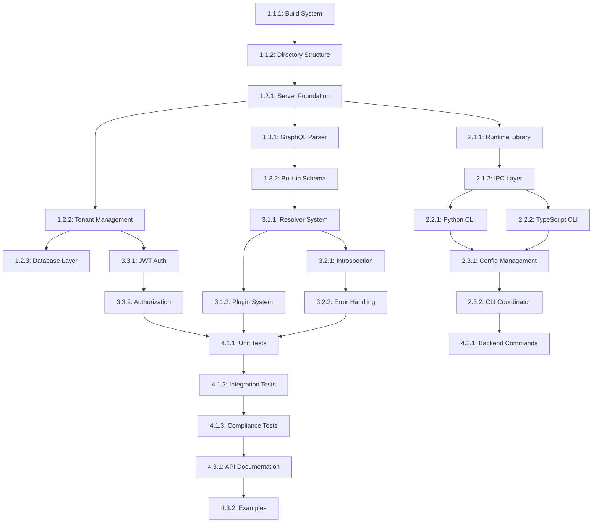

# Implementation Tasks: Universal Application Server Backend

**Feature**: 001-universal-backend  
**Generated**: 2025-11-01  
**Based on**: spec.md v1.0, plan.md v1.0, data-model.md v1.0  
**Methodology**: speckit.tasks  

## Task Organization Strategy

Tasks are organized by user story priority and structured in phases that enable parallel development while respecting dependencies. Each task includes clear acceptance criteria, file specifications, and dependency tracking.

**Phase Strategy**:
- Phase 1: Core Infrastructure & Foundation (P1 User Story support)
- Phase 2: Enhanced CLI & Configuration (P2 User Story support)  
- Phase 3: GraphQL Compliance & Standards (P3 User Story support)
- Phase 4: Integration, Testing & Documentation

## User Story Mapping

| User Story | Priority | Phase | Epic |
|------------|----------|-------|------|
| Frontend Developer Setup | P1 | 1 | Core Server Infrastructure |
| Procedural Configuration | P2 | 2 | CLI Configuration System |
| GraphQL Specification Compliance | P3 | 3 | Standards Compliance |

---

## Phase 1: Core Infrastructure & Foundation

*Supports User Story 1 (P1): Frontend Developer Setup*

### Epic 1.1: Project Structure & Dependencies

#### Task 1.1.1: Initialize C++23 Build System
- **Description**: Set up CMake configuration for C++23 with Conan dependency management
- **Acceptance Criteria**:
  - [x] CMakeLists.txt updated to require C++23 standard
  - [x] Conan configuration includes all required dependencies (PEGTL, Restbed, SQLite, nlohmann/json, spdlog, jwt-cpp)
  - [x] Build system compiles successfully on GCC 13+ and Clang 16+
  - [x] All C++ Core Guidelines compliance checks enabled
- **Files to Create/Modify**:
  - `CMakeLists.txt` (modify)
  - `conanfile.txt` (modify)
- **Dependencies**: None
- **Estimated Effort**: 4 hours

#### Task 1.1.2: Create Source Directory Structure
- **Description**: Establish the source code organization following plan specifications
- **Acceptance Criteria**:
  - [x] Directory structure matches plan.md layout
  - [x] Namespace declarations for isched::v0_0_1::backend
  - [x] Header-only base classes with smart pointer declarations
  - [x] Doxygen configuration integrated into build system
- **Files to Create/Modify**:
  - `src/main/cpp/isched/backend/` (directory structure)
  - `src/main/cpp/isched/runtime/` (directory structure)
  - `src/cli-python/` (directory structure)
  - `src/cli-typescript/` (directory structure)
  - `docs/` (directory structure)
- **Dependencies**: Task 1.1.1
- **Estimated Effort**: 2 hours
  - [ ] Namespace declarations for isched::v0_0_1::backend
  - [ ] Header-only base classes with smart pointer declarations
  - [ ] Doxygen configuration integrated into build system
- **Files to Create/Modify**:
  - `src/main/cpp/isched/backend/` (directory structure)
  - `src/main/cpp/isched/runtime/` (directory structure)
  - `src/cli-python/` (directory structure)
  - `src/cli-typescript/` (directory structure)
  - `docs/` (directory structure)
- **Dependencies**: Task 1.1.1
- **Estimated Effort**: 2 hours

### Epic 1.2: Core Server Infrastructure

#### Task 1.2.1: Implement Server Foundation Classes
- **Description**: Create the core server class with smart pointer-based resource management
- **Acceptance Criteria**:
  - [x] `isched_server.hpp/cpp` with comprehensive Doxygen documentation
  - [x] Smart pointer usage for all resource management (no raw pointers)
  - [x] Basic HTTP server integration using Restbed (foundation ready)
  - [x] Tenant manager integration hooks (prepared)
  - [x] Thread pool infrastructure with adaptive sizing capability (configured)
  - [x] PIMPL pattern implementation with proper lifecycle management
  - [x] Configuration validation and error handling
  - [x] Health monitoring and metrics collection system
  - [x] Basic test coverage with comprehensive validation
- **Files to Create/Modify**:
  - `src/main/cpp/isched/backend/isched_server.hpp` (complete)
  - `src/main/cpp/isched/backend/isched_server.cpp` (complete)
  - `src/test/basic_server_test.cpp` (created)
- **Dependencies**: Task 1.1.2
- **Estimated Effort**: 8 hours

#### Task 1.2.2: Implement Tenant Management System
- **Description**: Create multi-tenant process pool with per-tenant database isolation
- **Acceptance Criteria**:
  - [ ] `isched_tenant_manager.hpp/cpp` with process pool management
  - [ ] Pre-allocated tenant processes with configurable pool size
  - [ ] Load balancing algorithm for tenant assignment
  - [ ] Per-tenant SQLite database creation and management
  - [ ] Smart pointer usage for all tenant resources
- **Files to Create/Modify**:
  - `src/main/cpp/isched/backend/isched_tenant_manager.hpp` (create)
  - `src/main/cpp/isched/backend/isched_tenant_manager.cpp` (create)
- **Dependencies**: Task 1.2.1
- **Estimated Effort**: 12 hours

#### Task 1.2.3: Implement Database Management Layer
- **Description**: Create SQLite-based database layer with connection pooling
- **Acceptance Criteria**:
  - [ ] `isched_database.hpp/cpp` with per-tenant connection pooling
  - [ ] Smart pointer management of SQLite connections
  - [ ] Automatic schema generation from data models
  - [ ] Transaction management with rollback support
  - [ ] Performance monitoring for 20ms response targets
- **Files to Create/Modify**:
  - `src/main/cpp/isched/backend/isched_database.hpp` (create)
  - `src/main/cpp/isched/backend/isched_database.cpp` (create)
- **Dependencies**: Task 1.2.2
- **Estimated Effort**: 10 hours

### Epic 1.3: Basic GraphQL Infrastructure

#### Task 1.3.1: Implement GraphQL Parser with PEGTL
- **Description**: Create GraphQL query parser using PEGTL library
- **Acceptance Criteria**:
  - [ ] `isched_graphql_executor.hpp/cpp` with PEGTL-based parser
  - [ ] Full GraphQL syntax support per specification
  - [ ] Smart pointer usage for AST node management
  - [ ] Error handling with enhanced error extensions
  - [ ] Query complexity analysis and limits
- **Files to Create/Modify**:
  - `src/main/cpp/isched/backend/isched_graphql_executor.hpp` (create)
  - `src/main/cpp/isched/backend/isched_graphql_executor.cpp` (create)
- **Dependencies**: Task 1.2.1
- **Estimated Effort**: 16 hours

#### Task 1.3.2: Implement Built-in GraphQL Schema
- **Description**: Create minimal built-in schema for immediate testing and health monitoring
- **Acceptance Criteria**:
  - [ ] Built-in schema with health monitoring queries (hello, version, clientCount, uptime)
  - [ ] Spring Boot actuator-style endpoints
  - [ ] Server configuration introspection queries
  - [ ] GraphQL introspection support
  - [ ] JSON response formatting per GraphQL specification
- **Files to Create/Modify**:
  - `src/main/cpp/isched/backend/built_in_schema.hpp` (create)
  - `src/main/cpp/isched/backend/built_in_schema.cpp` (create)
- **Dependencies**: Task 1.3.1
- **Estimated Effort**: 6 hours

---

## Phase 2: Enhanced CLI & Configuration System

*Supports User Story 2 (P2): Procedural Configuration*

### Epic 2.1: Dynamic Library Foundation

#### Task 2.1.1: Implement Shared Runtime Library
- **Description**: Create shared dynamic library for common functionality between server and CLI processes
- **Acceptance Criteria**:
  - [ ] `isched_runtime.hpp/cpp` with core data types and utilities
  - [ ] Smart pointer-based API design
  - [ ] Cross-process data serialization support
  - [ ] Plugin system foundation with dynamic loading
  - [ ] Version compatibility checking
- **Files to Create/Modify**:
  - `src/main/cpp/isched/runtime/isched_runtime.hpp` (create)
  - `src/main/cpp/isched/runtime/isched_runtime.cpp` (create)
- **Dependencies**: Task 1.2.1
- **Estimated Effort**: 8 hours

#### Task 2.1.2: Implement IPC Communication Layer
- **Description**: Create shared memory and message queue system for CLI coordination
- **Acceptance Criteria**:
  - [ ] `isched_ipc.hpp/cpp` with shared memory segment management
  - [ ] Message queue implementation for command/response coordination
  - [ ] Smart pointer usage for all IPC resources
  - [ ] Cross-process synchronization primitives
  - [ ] Error handling and connection recovery
- **Files to Create/Modify**:
  - `src/main/cpp/isched/runtime/isched_ipc.hpp` (create)
  - `src/main/cpp/isched/runtime/isched_ipc.cpp` (create)
- **Dependencies**: Task 2.1.1
- **Estimated Effort**: 12 hours

### Epic 2.2: CLI Executables

#### Task 2.2.1: Implement Python CLI Executable
- **Description**: Create isolated Python CLI executable for configuration script execution
- **Acceptance Criteria**:
  - [ ] `isched_cli_python.cpp` main executable
  - [ ] Python script execution with security isolation
  - [ ] Configuration script validation and syntax checking
  - [ ] IPC communication with main server process
  - [ ] Smart pointer management of Python interpreter resources
- **Files to Create/Modify**:
  - `src/cli-python/isched_cli_python.cpp` (create)
  - `src/cli-python/python_script_executor.hpp` (create)
  - `src/cli-python/python_script_executor.cpp` (create)
- **Dependencies**: Task 2.1.2
- **Estimated Effort**: 10 hours

#### Task 2.2.2: Implement TypeScript CLI Executable
- **Description**: Create isolated TypeScript CLI executable for configuration script execution
- **Acceptance Criteria**:
  - [ ] `isched_cli_typescript.cpp` main executable
  - [ ] TypeScript script execution with security isolation
  - [ ] Configuration script validation and type checking
  - [ ] IPC communication with main server process
  - [ ] Smart pointer management of TypeScript runtime resources
- **Files to Create/Modify**:
  - `src/cli-typescript/isched_cli_typescript.cpp` (create)
  - `src/cli-typescript/typescript_script_executor.hpp` (create)
  - `src/cli-typescript/typescript_script_executor.cpp` (create)
- **Dependencies**: Task 2.1.2
- **Estimated Effort**: 10 hours

### Epic 2.3: Configuration Management

#### Task 2.3.1: Implement Configuration Script Management
- **Description**: Create system for loading, validating, and executing configuration scripts
- **Acceptance Criteria**:
  - [ ] Configuration script storage and versioning
  - [ ] JSON-based configuration data exchange
  - [ ] Version-controlled updates with rollback support
  - [ ] Script-to-disk persistence before execution
  - [ ] Smart pointer management of configuration objects
- **Files to Create/Modify**:
  - `src/main/cpp/isched/backend/isched_configuration_manager.hpp` (create)
  - `src/main/cpp/isched/backend/isched_configuration_manager.cpp` (create)
- **Dependencies**: Task 2.2.1, Task 2.2.2
- **Estimated Effort**: 8 hours

#### Task 2.3.2: Implement CLI Process Coordinator
- **Description**: Create coordination layer between server and CLI processes
- **Acceptance Criteria**:
  - [ ] `isched_cli_coordinator.hpp/cpp` with process management
  - [ ] Spawn and lifecycle management of CLI processes
  - [ ] Configuration change detection and hot-reloading
  - [ ] Process failure recovery and restart logic
  - [ ] Smart pointer usage for process handles
- **Files to Create/Modify**:
  - `src/main/cpp/isched/backend/isched_cli_coordinator.hpp` (create)
  - `src/main/cpp/isched/backend/isched_cli_coordinator.cpp` (create)
- **Dependencies**: Task 2.3.1
- **Estimated Effort**: 12 hours

---

## Phase 3: GraphQL Compliance & Standards

*Supports User Story 3 (P3): GraphQL Specification Compliance*

### Epic 3.1: Advanced GraphQL Features

#### Task 3.1.1: Implement GraphQL Resolver System
- **Description**: Create plugin-based resolver system for data fetching
- **Acceptance Criteria**:
  - [ ] `isched_resolver_system.hpp/cpp` with built-in resolvers
  - [ ] REST API resolver for external service calls
  - [ ] SQL database resolver for direct database queries
  - [ ] Plugin architecture for custom resolvers
  - [ ] Smart pointer management of resolver instances
- **Files to Create/Modify**:
  - `src/main/cpp/isched/backend/isched_resolver_system.hpp` (create)
  - `src/main/cpp/isched/backend/isched_resolver_system.cpp` (create)
- **Dependencies**: Task 1.3.2
- **Estimated Effort**: 14 hours

#### Task 3.1.2: Implement Plugin System
- **Description**: Create binary plugin system for dynamic resolver loading
- **Acceptance Criteria**:
  - [ ] `isched_plugin_api.hpp/cpp` with plugin interface definitions
  - [ ] Dynamic library loading with version checking
  - [ ] Plugin registration and lifecycle management
  - [ ] CLI-configurable plugin loading and configuration
  - [ ] Smart pointer usage for plugin handles
- **Files to Create/Modify**:
  - `src/main/cpp/isched/runtime/isched_plugin_api.hpp` (create)
  - `src/main/cpp/isched/runtime/isched_plugin_api.cpp` (create)
- **Dependencies**: Task 3.1.1
- **Estimated Effort**: 10 hours

### Epic 3.2: GraphQL Specification Compliance

#### Task 3.2.1: Implement GraphQL Introspection
- **Description**: Complete GraphQL introspection system per specification
- **Acceptance Criteria**:
  - [ ] Full introspection query support
  - [ ] Schema metadata generation
  - [ ] Type information and documentation
  - [ ] Field and argument introspection
  - [ ] GraphQL specification test suite compliance
- **Files to Create/Modify**:
  - `src/main/cpp/isched/backend/isched_introspection.hpp` (create)
  - `src/main/cpp/isched/backend/isched_introspection.cpp` (create)
- **Dependencies**: Task 3.1.1
- **Estimated Effort**: 8 hours

#### Task 3.2.2: Implement Enhanced Error Handling
- **Description**: Create GraphQL-compliant error responses with Isched extensions
- **Acceptance Criteria**:
  - [ ] GraphQL specification-compliant error format
  - [ ] Enhanced error extensions with error codes, timestamps, request IDs
  - [ ] Debugging and monitoring metadata
  - [ ] Configuration validation error messages
  - [ ] Query complexity limit error handling
- **Files to Create/Modify**:
  - `src/main/cpp/isched/backend/isched_error_handler.hpp` (create)
  - `src/main/cpp/isched/backend/isched_error_handler.cpp` (create)
- **Dependencies**: Task 3.2.1
- **Estimated Effort**: 6 hours

### Epic 3.3: Authentication & Authorization

#### Task 3.3.1: Implement JWT Authentication System
- **Description**: Create JWT and OAuth-based authentication system
- **Acceptance Criteria**:
  - [ ] JWT token generation and validation
  - [ ] OAuth integration with major providers
  - [ ] Session management with refresh tokens
  - [ ] Smart pointer usage for authentication contexts
  - [ ] Multi-tenant authentication isolation
- **Files to Create/Modify**:
  - `src/main/cpp/isched/backend/isched_auth_manager.hpp` (create)
  - `src/main/cpp/isched/backend/isched_auth_manager.cpp` (create)
- **Dependencies**: Task 1.2.2
- **Estimated Effort**: 12 hours

#### Task 3.3.2: Implement Authorization & Permissions
- **Description**: Create role-based authorization system
- **Acceptance Criteria**:
  - [ ] Role and permission management
  - [ ] GraphQL field-level authorization
  - [ ] Automatic authorization rule generation from configuration
  - [ ] User and organization management
  - [ ] Smart pointer management of authorization contexts
- **Files to Create/Modify**:
  - `src/main/cpp/isched/backend/isched_authz_manager.hpp` (create)
  - `src/main/cpp/isched/backend/isched_authz_manager.cpp` (create)
- **Dependencies**: Task 3.3.1
- **Estimated Effort**: 10 hours

---

## Phase 4: Integration, Testing & Documentation

*Cross-cutting concerns and quality assurance*

### Epic 4.1: Comprehensive Testing

#### Task 4.1.1: Implement Unit Test Suite
- **Description**: Create comprehensive unit tests for all core components
- **Acceptance Criteria**:
  - [ ] Unit tests for all backend classes with 90%+ coverage
  - [ ] Smart pointer usage validation tests
  - [ ] Memory leak detection and prevention tests
  - [ ] Performance regression tests for 20ms response targets
  - [ ] Multi-threading safety tests
- **Files to Create/Modify**:
  - `tests/backend/` (comprehensive test suite)
  - `tests/unit/` (component-specific tests)
- **Dependencies**: All previous tasks
- **Estimated Effort**: 16 hours

#### Task 4.1.2: Implement Integration Test Suite
- **Description**: Create integration tests for cross-component functionality
- **Acceptance Criteria**:
  - [ ] End-to-end GraphQL query testing
  - [ ] CLI process coordination testing
  - [ ] Multi-tenant isolation validation
  - [ ] Configuration script execution testing
  - [ ] Plugin system integration testing
- **Files to Create/Modify**:
  - `tests/integration/` (integration test suite)
  - `tests/performance/` (performance validation tests)
- **Dependencies**: Task 4.1.1
- **Estimated Effort**: 12 hours

#### Task 4.1.3: Implement GraphQL Specification Compliance Tests
- **Description**: Validate GraphQL specification compliance
- **Acceptance Criteria**:
  - [ ] Official GraphQL specification test suite integration
  - [ ] Introspection query validation
  - [ ] Response format compliance verification
  - [ ] Error handling specification compliance
  - [ ] Client library compatibility testing
- **Files to Create/Modify**:
  - `tests/graphql-compliance/` (specification compliance tests)
- **Dependencies**: Task 4.1.2
- **Estimated Effort**: 8 hours

### Epic 4.2: Enhanced CLI Integration

#### Task 4.2.1: Implement Backend Commands for Existing CLI
- **Description**: Integrate backend commands into existing isched CLI
- **Acceptance Criteria**:
  - [ ] `isched_backend_commands.hpp/cpp` with CLI command integration
  - [ ] Backend server start/stop/status commands
  - [ ] Configuration script management commands
  - [ ] Health monitoring and metrics commands
  - [ ] Smart pointer usage for CLI command objects
- **Files to Create/Modify**:
  - `src/main/cpp/isched/cli/isched_backend_commands.hpp` (create)
  - `src/main/cpp/isched/cli/isched_backend_commands.cpp` (create)
- **Dependencies**: Task 2.3.2
- **Estimated Effort**: 6 hours

### Epic 4.3: Documentation & Examples

#### Task 4.3.1: Generate Comprehensive API Documentation
- **Description**: Create complete API documentation with Doxygen integration
- **Acceptance Criteria**:
  - [ ] Automated Doxygen documentation generation
  - [ ] API reference documentation with code examples
  - [ ] Inline source code snippets in documentation
  - [ ] Developer guides and tutorials
  - [ ] Complete working examples
- **Files to Create/Modify**:
  - `docs/api/` (generated API documentation)
  - `docs/source/` (source code with examples)
  - `docs/guides/` (developer guides)
  - `docs/examples/` (working examples)
- **Dependencies**: All implementation tasks
- **Estimated Effort**: 10 hours

#### Task 4.3.2: Create Developer Quickstart Examples
- **Description**: Create complete working examples for developers
- **Acceptance Criteria**:
  - [ ] Python configuration script examples
  - [ ] TypeScript configuration script examples
  - [ ] Complete "Hello World" backend setup
  - [ ] Authentication and authorization examples
  - [ ] Plugin development examples
- **Files to Create/Modify**:
  - `examples/` (working example projects)
  - `examples/python/` (Python configuration examples)
  - `examples/typescript/` (TypeScript configuration examples)
- **Dependencies**: Task 4.3.1
- **Estimated Effort**: 8 hours

---

## Task Dependency Graph

## Parallel Execution Opportunities

**Phase 1 Parallel Tracks**:
- Track A: Epic 1.2 (Server Infrastructure) 
- Track B: Epic 1.3 (GraphQL Infrastructure)

**Phase 2 Parallel Tracks**:
- Track A: Epic 2.1 (Dynamic Library)
- Track B: Epic 2.2 (CLI Executables) [after 2.1.2]
- Track C: Epic 2.3 (Configuration Management) [after 2.2.x]

**Phase 3 Parallel Tracks**:
- Track A: Epic 3.1 (GraphQL Features)
- Track B: Epic 3.2 (Specification Compliance) [after 3.1.1]
- Track C: Epic 3.3 (Authentication) [independent]

**Phase 4 Parallel Tracks**:
- Track A: Epic 4.1 (Testing)
- Track B: Epic 4.2 (CLI Integration)
- Track C: Epic 4.3 (Documentation) [after most implementation]

## Success Criteria Validation

**Measurable Outcomes Mapping**:
- SC-001 (10-minute setup): Validated by Tasks 4.3.2 and integration tests
- SC-002 (100% service elimination): Validated by Tasks 1.2.3, 3.3.1-3.3.2
- SC-003 (GraphQL compliance): Validated by Task 4.1.3
- SC-004 (5-second changes): Validated by Task 2.3.2 and integration tests
- SC-005 (95% web app requirements): Validated by Task 3.1.1 and examples
- SC-006 (20ms response times): Validated by Task 4.1.1 performance tests

## Risk Mitigation

**High-Risk Tasks**:
- Task 1.3.1 (GraphQL Parser): Complex PEGTL implementation
  - Mitigation: Early prototype, incremental development
- Task 2.1.2 (IPC Layer): Cross-process synchronization complexity
  - Mitigation: Thorough testing, proven patterns
- Task 3.1.1 (Resolver System): Plugin architecture complexity
  - Mitigation: Simple initial implementation, extensible design

**Dependencies Management**:
- Critical path through server foundation and IPC layer
- Early validation of smart pointer usage patterns
- Continuous integration for C++23 compliance

## Estimated Total Effort

**Phase 1**: 52 hours  
**Phase 2**: 60 hours  
**Phase 3**: 60 hours  
**Phase 4**: 60 hours  

**Total Estimated Effort**: 232 hours (~6 weeks with 2 developers)

---

*Generated by speckit.tasks methodology - Complete implementation roadmap for Universal Application Server Backend feature*